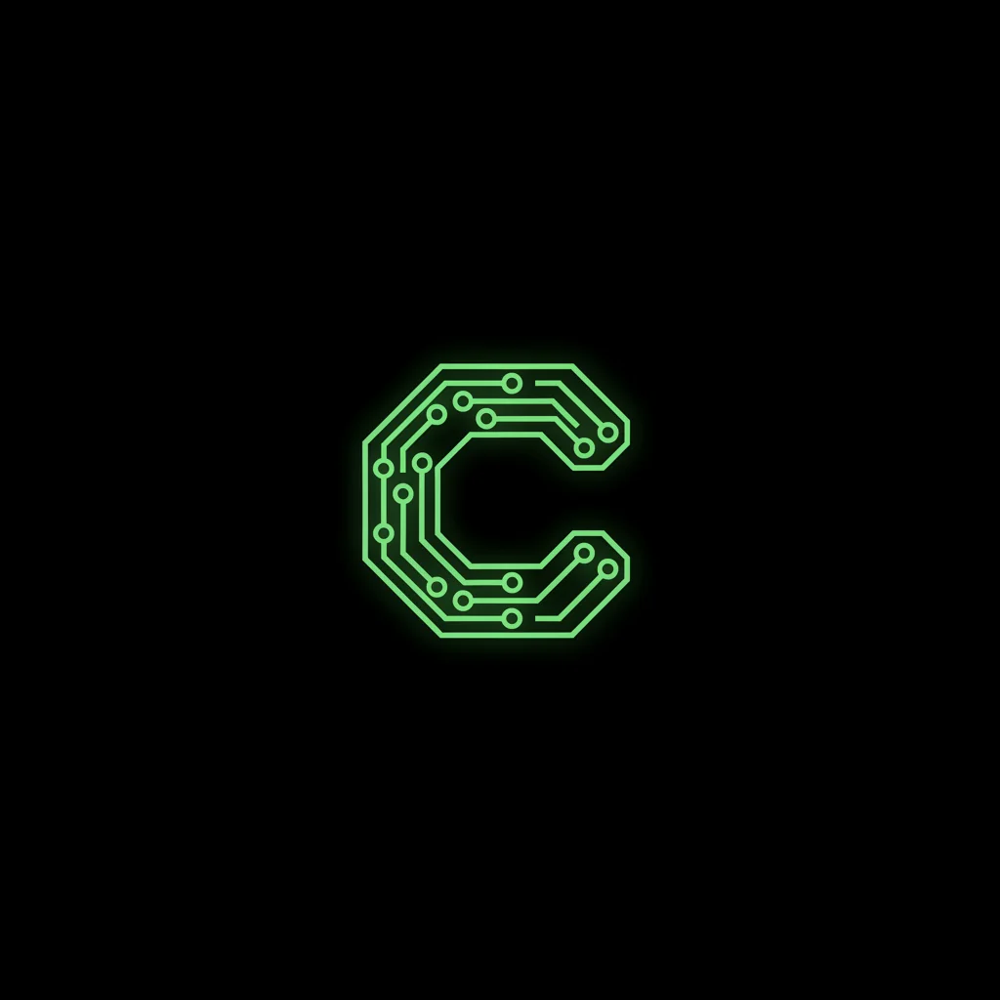
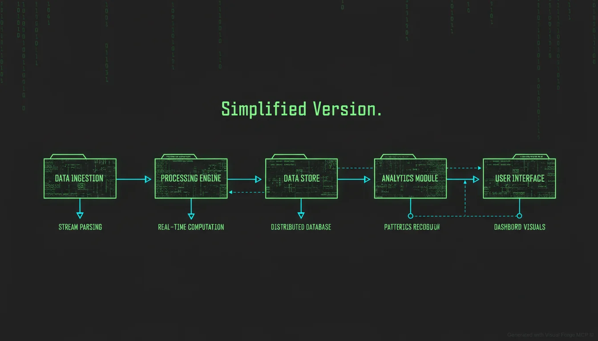

# The Construct - Complete Guide

<p align="center">
  
</p>

<p align="center">
  <strong>AI Orchestration Architecture</strong><br>
  <em>"Code that calls AI, not AI that calls code"</em>
</p>

---

> **⚠️ Work in Progress**
>
> This project is actively under development. The core architecture is implemented with **927 passing tests**, but APIs may evolve and some features are still being refined.
>
> **We welcome contributors!** Whether you're a developer, documentation writer, or just someone with great ideas, we'd love your help shaping the future of AI orchestration. See [CONTRIBUTING.md](CONTRIBUTING.md) to get started.

---

> *"The Matrix is everywhere. It is all around us. Even now, in this very room. You can see it when you look out your window or when you turn on your television. You can feel it when you go to work... when you go to church... when you pay your taxes."*
>
> — Morpheus

Welcome to **The Construct**. This guide will show you how deep the rabbit hole goes.

<p align="center">
  
</p>

<p align="center">
  <em>Data flows through well-defined stages with code-enforced control at every step</em>
</p>

---

## Table of Contents

1. [What is The Construct?](#what-is-the-construct)
2. [Why Do We Need This?](#why-do-we-need-this)
3. [The Matrix Analogy](#the-matrix-analogy)
4. [Architecture Components](#architecture-components)
5. [Installation](#installation)
6. [Quick Start](#quick-start)
7. [Core Concepts](#core-concepts)
8. [Writing Contracts](#writing-contracts)
9. [Using the Migration Wizard](#using-the-migration-wizard)
10. [Integrating with New Projects](#integrating-with-new-projects)
11. [Testing](#testing)
12. [Advanced Topics](#advanced-topics)
13. [Troubleshooting](#troubleshooting)
14. [FAQ](#faq)

---

## What is The Construct?

> *"This is the Construct. It's our loading program. We can load anything, from clothing to equipment, weapons, training simulations... anything we need."*
>
> — Morpheus

**The Construct** is a reference architecture for AI orchestration that enforces one fundamental principle:

### **"Code that calls AI, not AI that calls code"**

In The Matrix films, the Construct is a loading program—a controlled environment where anything can be loaded and tested safely. Similarly, our Construct is an architecture where:

- **Code controls the workflow** (not AI)
- **AI works within enforced contracts** (not freestyle)
- **Rules are enforced by code** (not by hoping AI follows instructions)

It's NOT a framework you install—it's a **pattern/architecture** you implement. Think of it as the blueprints for building your own Matrix, where you're the Architect.

---

## Why Do We Need This?

### The Red Pill Reality

Let's face the uncomfortable truth about AI development today:

#### Problem 1: AI Amnesia

```markdown
# CLAUDE.md
Please follow these rules:
- Never delete files without confirmation
- Always run tests before committing
- Use TypeScript strict mode

# What Actually Happens
AI: *deletes files* *skips tests* *uses any*
AI: "Oops, I forgot about those rules!"
```

Sound familiar? AI assistants **ignore** configuration files like CLAUDE.md. They get distracted, "forget" rules, and do their own thing. This isn't malice—it's just how LLMs work.

#### Problem 2: The All-or-Nothing Trap

| Approach | Problem |
|----------|---------|
| **Pure Rules** | If everything is deterministic, why use AI at all? |
| **Pure AI** | Unpredictable, ignores constraints, "creative" deletions |
| **Hope-Based** | "Please follow these rules" → AI ignores them |

#### Problem 3: Provider Lock-in

Your code is tightly coupled to OpenAI? Good luck switching to Anthropic, Google, or running locally with Ollama. Every provider has different APIs, different tool calling formats, different quirks.

### The Solution: Take Control

The Construct solves these problems by:

1. **Code Enforces Rules** - Rules checked by code at every step, not by AI's willingness
2. **Contracts Define Boundaries** - AI operates within formal contracts with clear constraints
3. **Provider Agnostic** - Keymaker abstracts all providers behind a unified interface
4. **Positive Incentives** - XP system rewards good work (no punishments)
5. **Observable & Auditable** - Every action logged, every decision traceable

---

## The Matrix Analogy

Every component in The Construct maps to a character from The Matrix:

```
┌─────────────────────────────────────────────────────────────────┐
│                        THE ARCHITECT                             │
│                      (Source of Truth)                           │
│                                                                  │
│  "I am the Architect. I created the Matrix."                    │
│                                                                  │
│  The cold, logical designer. Holds all truth, rules, limits.    │
│  Immutable during execution. The final word on everything.       │
└──────────────────────────────┬──────────────────────────────────┘
                               │
            ┌──────────────────┼──────────────────┐
            │                  │                  │
            ▼                  │                  │
┌───────────────────┐          │          ┌───────────────────┐
│    THE ORACLE     │          │          │   AGENT SMITH     │
│  (Judgment &      │◀─────────┤          │    (Security)     │
│   Insight)        │          │          │                   │
│                   │          │          │  Zero Trust       │
│  "I'm not here to │          │          │  Authentication   │
│  tell you how     │          │          │  Threat Detection │
│  this is going to │          │          │                   │
│  end..."          │          │          │  "Me... me...     │
│                   │          │          │   me..."          │
│  Collects         │          │          │                   │
│  feedback, awards │          │          │                   │
│  XP, sees         │          │          │                   │
│  patterns         │          │          │                   │
└─────────┬─────────┘          │          └─────────┬─────────┘
          │                    │                    │
          │ informed by        │ inherits           │ protects
          │ judgments          │ truth              │
          ▼                    ▼                    ▼
┌─────────────────────────────────────────────────────────────────┐
│                        THE AGENTS                                │
│                      (Orchestrator)                              │
│                                                                  │
│  "Never send a human to do a machine's job."                    │
│                                                                  │
│  Executes the Architect's design. Issues contracts.             │
│  Controls the state machine. Cannot modify truth.                │
└──────────────────────────────┬──────────────────────────────────┘
                               │
            ┌──────────────────┼──────────────────┐
            │                  │                  │
            ▼                  │                  ▼
┌───────────────────┐          │          ┌───────────────────┐
│   THE SENTINELS   │◀─────────┘          │    THE TWINS      │
│  (QA &            │  polices            │  (Chaos Testing)  │
│   Enforcement)    │  agents             │                   │
│                   │                     │  "We are getting  │
│  "Search and      │                     │   aggravated."    │
│   destroy!"       │                     │                   │
│                   │                     │  Ghost: Faults    │
│  Validates        │                     │  Phantom: Pen     │
│  outputs, blocks  │                     │  Testing          │
│  unauthorized     │                     │                   │
│  actions          │                     │                   │
└─────────┬─────────┘                     └───────────────────┘
          │
          ▼
┌─────────────────────────────────────────────────────────────────┐
│                       THE PROGRAMS                               │
│                        (Workers)                                 │
│                                                                  │
│  "Every program that is created must have a purpose."           │
│                                                                  │
│  Execute tasks within contracts. Report to Oracle.              │
│  Earn XP, level up through good work.                           │
└──────────────────────────────┬──────────────────────────────────┘
                               │
                               ▼
┌─────────────────────────────────────────────────────────────────┐
│                       THE KEYMAKER                               │
│                     (Tool Adapter)                               │
│                                                                  │
│  "I know because I must know. It is my purpose."                │
│                                                                  │
│  Opens doors to any AI provider. Provider-agnostic              │
│  tool calling via LiteLLM.                                       │
└─────────────────────────────────────────────────────────────────┘
```

### Why These Characters?

| Character | Matrix Role | Construct Role | Why It Fits |
|-----------|-------------|----------------|-------------|
| **Architect** | Creator of the Matrix | Source of Truth | Cold, logical, absolute authority |
| **Oracle** | Sees the future, guides | Judgment & XP system | Observes patterns, provides insights |
| **Agents** | Enforce Matrix rules | Orchestration | Enforce rules, issue contracts |
| **Sentinels** | Hunt in the real world | QA enforcement | Search and destroy bad outputs |
| **Programs** | Serve functions | Workers | Every program must have a purpose |
| **Keymaker** | Opens any door | Provider adapter | Opens doors to any AI provider |
| **Smith** | Security program | Zero Trust security | Multiply to handle threats |
| **Twins** | Chaos agents | Chaos engineering | Test resilience through chaos |
| **Morpheus** | Frees minds | Migration wizard | Guides migration to The Construct |

---

## Architecture Components

<p align="center">
  
</p>

### 1. The Architect (Source of Truth)

> *"I am the Architect. I have been waiting for you."*

The Architect holds all configuration, rules, and truth. It's **immutable during execution**.

```typescript
import { Architect, createArchitect } from 'the-construct';

const architect = createArchitect({
  configPath: './construct/architect.yaml',
});

// Load the truth
await architect.load();

// Access configurations (read-only)
const config = architect.getConfig();
const rules = architect.getRules();
const limits = architect.getLimits();
```

**What it contains:**
- Provider configurations
- Model rules and limits
- Cost limits
- Path restrictions
- Quality requirements
- Contract templates

### 2. The Oracle (Judgment & Insight)

> *"I'm not here to tell you how this is going to end. I'm here to tell you how it's going to begin."*

The Oracle collects execution results, awards XP, and provides insights.

```typescript
import { Oracle, createOracle } from 'the-construct';

const oracle = createOracle({
  database: './construct/oracle.db',
});

// Submit execution result for judgment
const judgment = await oracle.judge({
  contractId: 'my-contract',
  agentId: 'writer-agent',
  result: executionResult,
});

// Agent earns XP based on performance
console.log(`XP awarded: ${judgment.xpAwarded}`);
console.log(`New level: ${judgment.newLevel}`);
```

**The XP System:**
- Good work → Earn XP
- Bad work → Earn 0 XP (no penalties)
- Level up → Unlock capabilities
- Insights → Learn from patterns

### 3. The Agents (Orchestrator)

> *"Never send a human to do a machine's job."*

Agents orchestrate contract execution. They don't make rules—they enforce them.

```typescript
import { Agent, createAgent } from 'the-construct';

const agent = createAgent({
  id: 'writer-agent',
  architect,
  oracle,
});

// Execute a contract
const result = await agent.execute({
  contractId: 'generate-code',
  input: { task: 'Create a REST API' },
});
```

### 4. The Sentinels (QA & Enforcement)

> *"Search and destroy!"*

Sentinels validate outputs, block unauthorized actions, and ensure quality.

```typescript
import { Sentinels, createSentinels } from 'the-construct';

const sentinels = createSentinels({ architect });

// Validate output
const validation = await sentinels.validate({
  contractId: 'generate-code',
  output: result.output,
});

if (!validation.passed) {
  console.log('Blocked:', validation.violations);
}

// Block forbidden paths
const pathCheck = sentinels.checkPath('/etc/passwd');
// Result: { allowed: false, reason: 'Forbidden system path' }
```

### 5. The Programs (Workers)

> *"Every program that is created must have a purpose. If it does not, it is deleted."*

Programs execute tasks within contracts. They're the actual workers.

```typescript
import { Program, createProgram } from 'the-construct';

const program = createProgram({
  id: 'code-generator',
  keymaker,
});

// Execute within contract constraints
const output = await program.execute({
  contract,
  input: { prompt: 'Generate a function to sort arrays' },
});
```

### 6. The Keymaker (Tool Adapter)

> *"I know because I must know. It is my purpose. It is the reason I am here."*

The Keymaker opens doors to any AI provider through a unified interface.

```typescript
import { Keymaker, createKeymaker } from 'the-construct';

const keymaker = createKeymaker({
  defaultProvider: 'openai',
  providers: {
    openai: { apiKey: process.env.OPENAI_API_KEY },
    anthropic: { apiKey: process.env.ANTHROPIC_API_KEY },
    ollama: { baseUrl: 'http://localhost:11434' },
  },
});

// Works with any provider
const response = await keymaker.complete({
  model: 'gpt-4', // or 'claude-3-opus', 'llama2', etc.
  messages: [{ role: 'user', content: 'Hello' }],
});
```

### 7. Agent Smith (Security)

> *"I'm going to enjoy watching you die, Mr. Anderson."*

Smith provides Zero Trust security with continuous verification.

```typescript
import { Smith, createSmith } from 'the-construct';

const smith = createSmith({
  architect,
  threatLevel: 'high',
});

// Authenticate every request
const auth = await smith.authenticate(request);

// Detect threats
const threats = await smith.detectThreats(executionContext);

// Smith can "multiply" to handle increased threats
await smith.escalate(); // Spawns additional security processes
```

### 8. The Twins (Chaos Engineering)

> *"We are getting aggravated."*

The Twins test system resilience through controlled chaos.

```typescript
import { Twins, createTwins } from 'the-construct';

const twins = createTwins({ smith });

// Ghost: Inject faults
await twins.ghost.injectLatency({ target: 'keymaker', ms: 5000 });
await twins.ghost.failRequests({ target: 'openai', rate: 0.3 });

// Phantom: Penetration testing
const vulns = await twins.phantom.scan({ target: 'api-endpoint' });
```

### 9. Morpheus (Migration Wizard)

> *"I'm trying to free your mind, Neo. But I can only show you the door. You're the one that has to walk through it."*

Morpheus helps migrate existing projects to The Construct architecture.

```typescript
import { Morpheus, createMorpheus } from 'the-construct/morpheus';

const morpheus = createMorpheus({
  callbacks: {
    onMessage: (msg) => console.log(msg.text),
    onPillChoice: async () => 'red', // Take the red pill
  },
});

// Analyze existing project
const analysis = await morpheus.analyze('/path/to/project');

// Generate migration plan
const plan = await morpheus.plan(analysis);

// Execute migration
await morpheus.migrate(plan);
```

---

## Installation

### Prerequisites

- Node.js 18+
- npm or yarn
- (Optional) LiteLLM for multi-provider support

### Install the Package

```bash
# Using npm
npm install the-construct-architecture

# Using yarn
yarn add the-construct-architecture

# Using pnpm
pnpm add the-construct-architecture
```

### Install from Source

```bash
# Clone the repository
git clone https://github.com/your-org/the-construct-architecture.git
cd the-construct-architecture

# Install dependencies
npm install

# Build
npm run build

# Run tests
npm test
```

### Environment Setup

Create a `.env` file:

```bash
# AI Providers (use what you need)
OPENAI_API_KEY=sk-...
ANTHROPIC_API_KEY=sk-ant-...
GOOGLE_AI_KEY=...

# Optional: Local models via Ollama
OLLAMA_BASE_URL=http://localhost:11434

# Database (defaults to SQLite)
CONSTRUCT_DB_PATH=./construct.db
```

---

## Quick Start

### The Red Pill: Your First Contract

Let's create a simple code generation contract:

#### 1. Create the Architect Config

Create `construct/architect.yaml`:

```yaml
# The Architect - Source of Truth
project:
  name: my-first-construct
  version: "1.0.0"

global:
  defaultModel: gpt-4o-mini
  maxCostPerRequest: 0.50
  logLevel: info

models:
  allowed:
    - gpt-4o
    - gpt-4o-mini
    - claude-3-opus
    - claude-3-sonnet
  preferred: gpt-4o-mini

limits:
  costs:
    daily: 10.00
    monthly: 100.00
  tokens:
    maxInput: 4000
    maxOutput: 2000

rules:
  paths:
    forbidden:
      - /etc
      - /var
      - ~/.ssh
    allowed:
      - ./src
      - ./test
```

#### 2. Create a Contract

Create `construct/contracts/generate-function.yaml`:

```yaml
# Contract: Generate Function
id: my-project/generate-function
name: Generate Function
version: "1.0.0"
type: completion

metadata:
  created_at: "2024-01-01"
  priority: normal
  tags:
    - code-generation
    - typescript

requirements:
  description: |
    Generate a TypeScript function based on the provided specification.
    Follow best practices and include JSDoc comments.

goals:
  description: Generate a clean, well-documented TypeScript function
  objectives:
    - Generate syntactically correct TypeScript
    - Include proper type annotations
    - Add JSDoc documentation
    - Follow naming conventions
  success_threshold: 8

limitations:
  forbidden_actions:
    - Use 'any' type
    - Generate code with side effects unless specified
    - Include external dependencies without approval
  constraints:
    - Must be pure functions when possible
    - Maximum function length: 50 lines
    - Must include error handling

prompts:
  system: |
    You are a TypeScript code generator. Generate clean, type-safe code.
    Always include JSDoc comments and proper error handling.

  user: |
    Generate a TypeScript function with the following specification:

    Name: {{functionName}}
    Description: {{description}}
    Parameters: {{parameters}}
    Return type: {{returnType}}

limits:
  time:
    max_duration_ms: 30000
  retries:
    max_attempts: 3

quality:
  criteria:
    - name: type_safety
      weight: 0.3
      threshold: 9
    - name: documentation
      weight: 0.2
      threshold: 8
    - name: readability
      weight: 0.3
      threshold: 8
    - name: error_handling
      weight: 0.2
      threshold: 7
```

#### 3. Execute the Contract

```typescript
import {
  createArchitect,
  createOracle,
  createAgent,
  createKeymaker,
  createSentinels,
} from 'the-construct';

async function main() {
  // Initialize components
  const architect = createArchitect({ configPath: './construct/architect.yaml' });
  await architect.load();

  const oracle = createOracle({ database: ':memory:' });
  const keymaker = createKeymaker({
    defaultProvider: 'openai',
    providers: { openai: { apiKey: process.env.OPENAI_API_KEY } },
  });
  const sentinels = createSentinels({ architect });

  // Create an agent
  const agent = createAgent({
    id: 'code-agent',
    architect,
    oracle,
    keymaker,
    sentinels,
  });

  // Execute the contract
  const result = await agent.execute({
    contractId: 'my-project/generate-function',
    input: {
      functionName: 'calculateTotal',
      description: 'Calculate the total price with tax',
      parameters: 'items: CartItem[], taxRate: number',
      returnType: 'number',
    },
  });

  console.log('Generated code:', result.output);
  console.log('Quality score:', result.quality.score);
  console.log('XP awarded:', result.judgment.xpAwarded);
}

main();
```

---

## Core Concepts

### Contracts: The Foundation

Contracts are formal agreements that define what AI can and cannot do.

```yaml
# Every contract has these sections:
id: namespace/name           # Unique identifier
name: Human-readable name    # Display name
version: "1.0.0"             # Semver version
type: completion|chat|tool   # Execution type

requirements:                # What must be achieved
  description: ...

goals:                       # Success criteria
  objectives: [...]
  success_threshold: 8

limitations:                 # What is forbidden
  forbidden_actions: [...]
  constraints: [...]

prompts:                     # AI instructions
  system: ...
  user: ...

limits:                      # Resource limits
  time: ...
  tokens: ...
  cost: ...

quality:                     # Quality criteria
  criteria: [...]
```

### The Execution Flow

<p align="center">
  
</p>

```
┌──────────────┐
│   REQUEST    │
└──────┬───────┘
       │
       ▼
┌──────────────┐     ┌────────────┐
│   ARCHITECT  │────▶│  Validate  │
│  (get rules) │     │  contract  │
└──────────────┘     └─────┬──────┘
                           │
       ┌───────────────────┘
       │
       ▼
┌──────────────┐     ┌────────────┐
│    SMITH     │────▶│Authenticate│
│  (security)  │     │  & verify  │
└──────────────┘     └─────┬──────┘
                           │
       ┌───────────────────┘
       │
       ▼
┌──────────────┐     ┌────────────┐
│    AGENTS    │────▶│  Execute   │
│(orchestrate) │     │  contract  │
└──────────────┘     └─────┬──────┘
                           │
       ┌───────────────────┘
       │
       ▼
┌──────────────┐     ┌────────────┐
│   KEYMAKER   │────▶│  Call AI   │
│  (provider)  │     │  provider  │
└──────────────┘     └─────┬──────┘
                           │
       ┌───────────────────┘
       │
       ▼
┌──────────────┐     ┌────────────┐
│  SENTINELS   │────▶│  Validate  │
│    (QA)      │     │   output   │
└──────────────┘     └─────┬──────┘
                           │
       ┌───────────────────┘
       │
       ▼
┌──────────────┐     ┌────────────┐
│   ORACLE     │────▶│   Judge    │
│  (judgment)  │     │ & award XP │
└──────────────┘     └─────┬──────┘
                           │
       ┌───────────────────┘
       │
       ▼
┌──────────────┐
│   RESPONSE   │
└──────────────┘
```

### The XP & Level System

> *"I can only show you the door. You're the one that has to walk through it."*

Agents earn XP through good work and level up to unlock capabilities:

| Level | Title | XP Required | Unlocks |
|-------|-------|-------------|---------|
| 1 | Bluepill | 0 | Basic execution |
| 2 | Awakened | 100 | Better models |
| 3 | Operator | 500 | Tool usage |
| 4 | Rebel | 2000 | Multi-step contracts |
| 5 | The One | 10000 | Full autonomy |

**How XP is calculated:**
- Base XP for completion: 10
- Quality bonus: up to 20 (based on quality score)
- Efficiency bonus: up to 10 (faster = more XP)
- No penalties for failures (0 XP, not negative)

---

## Writing Contracts

### Contract Types

#### 1. Completion Contract

For single-turn text generation:

```yaml
id: my-app/summarize
type: completion

prompts:
  system: You are a summarizer.
  user: Summarize this: {{text}}
```

#### 2. Chat Contract

For multi-turn conversations:

```yaml
id: my-app/assistant
type: chat

prompts:
  system: You are a helpful assistant.

chat:
  maxTurns: 10
  memory: sliding_window
  memorySize: 5
```

#### 3. Tool Contract

For function calling:

```yaml
id: my-app/calculator
type: tool

tools:
  - name: calculate
    description: Perform a calculation
    parameters:
      type: object
      properties:
        expression:
          type: string
          description: Math expression
      required: [expression]
```

### Best Practices

1. **Be Specific in Constraints**
   ```yaml
   # Bad
   limitations:
     forbidden_actions:
       - Do bad things

   # Good
   limitations:
     forbidden_actions:
       - Delete files without confirmation
       - Access paths outside ./src
       - Make network requests
   ```

2. **Define Clear Success Criteria**
   ```yaml
   goals:
     objectives:
       - Output must be valid JSON
       - All required fields must be present
       - String lengths must be under 1000 chars
     success_threshold: 8  # Out of 10
   ```

3. **Set Appropriate Limits**
   ```yaml
   limits:
     time:
       max_duration_ms: 30000
     tokens:
       max_input: 4000
       max_output: 2000
     cost:
       max_cost: 0.10
   ```

---

## Using the Migration Wizard

> *"This is your last chance. After this, there is no turning back. You take the blue pill—the story ends, you wake up in your bed and believe whatever you want to believe. You take the red pill—you stay in Wonderland, and I show you how deep the rabbit hole goes."*

### The Nebuchadnezzar Crew

Morpheus leads a crew of specialized agents:

| Agent | Role | Specialization |
|-------|------|----------------|
| **Tank** | The Operator | Scans projects, analyzes dependencies |
| **Mouse** | The Designer | Generates configs and contracts |
| **Trinity** | The Expert | Deep code analysis, pattern detection |
| **Switch** | The Skeptic | Validates everything, audits changes |
| **Apoc** | The Strategist | Creates migration plans |

### Running the Wizard

#### CLI Mode

```bash
# Analyze an existing project
npx morpheus analyze /path/to/project

# Generate migration plan
npx morpheus plan /path/to/project

# Run full migration (interactive)
npx morpheus migrate /path/to/project
```

#### Programmatic Mode

```typescript
import {
  createMorpheus,
  createTank,
  createTrinity,
  createApoc,
  createMouse,
  createSwitch,
} from 'the-construct/morpheus';

async function migrate(projectPath: string) {
  // Initialize Morpheus
  const morpheus = createMorpheus({
    callbacks: {
      onMessage: (msg) => console.log(`[${msg.type}] ${msg.text}`),
      onProgress: (p) => console.log(`Progress: ${p.percentage}%`),
      onPillChoice: async (ctx) => {
        // Red pill: Full migration
        // Blue pill: Analysis only
        return 'red';
      },
    },
  });

  await morpheus.initialize();

  // Register the crew
  morpheus.registerAgent(createTank());
  morpheus.registerAgent(createTrinity());
  morpheus.registerAgent(createApoc());
  morpheus.registerAgent(createMouse());
  morpheus.registerAgent(createSwitch());

  // Step 1: Tank scans the project
  const tank = morpheus.getAgent('tank');
  const scan = await tank.scanProject(projectPath);
  console.log(`Found ${scan.statistics.totalFiles} files`);

  // Step 2: Trinity analyzes deeply
  const trinity = morpheus.getAgent('trinity');
  const analysis = await trinity.analyzeArchitecture(scan);
  console.log(`Architecture score: ${analysis.score}/100`);

  // Step 3: Apoc creates migration plan
  const apoc = morpheus.getAgent('apoc');
  const plan = await apoc.generateMigrationPlan(analysis, 'my-project');
  console.log(`Migration phases: ${plan.phases.length}`);
  console.log(`Estimated effort: ${plan.estimates.realistic} hours`);

  // Step 4: Mouse generates configs
  const mouse = morpheus.getAgent('mouse');
  const configs = await mouse.generateAllConfigs(analysis);

  // Step 5: Switch validates everything
  const switch_ = morpheus.getAgent('switch');
  for (const config of configs) {
    const validation = await switch_.validateConfig(config);
    if (!validation.valid) {
      console.log(`Issues in ${config.type}:`, validation.errors);
    }
  }

  await morpheus.shutdown();
}
```

### Migration Workflow

```
┌──────────────────────────────────────────────────────────────┐
│                    TAKE THE RED PILL                         │
└──────────────────────────────┬───────────────────────────────┘
                               │
                               ▼
┌──────────────────────────────────────────────────────────────┐
│  PHASE 1: SCAN (Tank)                                        │
│  - Analyze project structure                                  │
│  - Detect AI usage patterns                                   │
│  - Index dependencies                                         │
└──────────────────────────────┬───────────────────────────────┘
                               │
                               ▼
┌──────────────────────────────────────────────────────────────┐
│  PHASE 2: ANALYZE (Trinity)                                  │
│  - Deep code analysis                                         │
│  - Pattern & anti-pattern detection                           │
│  - Architecture assessment                                    │
└──────────────────────────────┬───────────────────────────────┘
                               │
                               ▼
┌──────────────────────────────────────────────────────────────┐
│  PHASE 3: PLAN (Apoc)                                        │
│  - Risk identification                                        │
│  - Phase generation                                           │
│  - Effort estimation                                          │
└──────────────────────────────┬───────────────────────────────┘
                               │
                               ▼
┌──────────────────────────────────────────────────────────────┐
│  PHASE 4: GENERATE (Mouse)                                   │
│  - Generate Architect config                                  │
│  - Generate contracts                                         │
│  - Generate scaffolding                                       │
└──────────────────────────────┬───────────────────────────────┘
                               │
                               ▼
┌──────────────────────────────────────────────────────────────┐
│  PHASE 5: VALIDATE (Switch)                                  │
│  - Validate all generated artifacts                          │
│  - Audit changes                                              │
│  - Recommend actions                                          │
└──────────────────────────────┬───────────────────────────────┘
                               │
                               ▼
┌──────────────────────────────────────────────────────────────┐
│                    WELCOME TO THE REAL WORLD                 │
└──────────────────────────────────────────────────────────────┘
```

---

## Integrating with New Projects

### Starting Fresh

If you're starting a new project, here's the recommended structure:

```
my-project/
├── construct/
│   ├── architect.yaml        # Main configuration
│   ├── contracts/            # Contract definitions
│   │   ├── code-gen.yaml
│   │   └── review.yaml
│   ├── truth/                # Additional truth sources
│   │   └── project.yaml
│   └── workflows/            # Workflow definitions
│       └── ci-pipeline.yaml
├── src/
│   └── ...
├── test/
│   └── ...
└── package.json
```

### Integration Steps

#### 1. Initialize The Construct

```bash
# Create construct directory
mkdir -p construct/contracts construct/truth construct/workflows

# Create architect config
cat > construct/architect.yaml << 'EOF'
project:
  name: my-new-project
  version: "1.0.0"

global:
  defaultModel: gpt-4o-mini
  maxCostPerRequest: 0.50

# ... rest of config
EOF
```

#### 2. Define Your Contracts

Create contracts for each AI task in your application:

```bash
# Code generation contract
cat > construct/contracts/generate-code.yaml << 'EOF'
id: my-project/generate-code
name: Code Generator
version: "1.0.0"
type: completion
# ...
EOF
```

#### 3. Initialize in Your App

```typescript
// src/construct.ts
import {
  createArchitect,
  createOracle,
  createAgent,
  createKeymaker,
  createSentinels,
} from 'the-construct';

export async function initializeConstruct() {
  const architect = createArchitect({
    configPath: './construct/architect.yaml',
  });
  await architect.load();

  const oracle = createOracle({
    database: './construct/oracle.db',
  });

  const keymaker = createKeymaker({
    defaultProvider: 'openai',
    providers: {
      openai: { apiKey: process.env.OPENAI_API_KEY },
    },
  });

  const sentinels = createSentinels({ architect });

  const agent = createAgent({
    id: 'main-agent',
    architect,
    oracle,
    keymaker,
    sentinels,
  });

  return { architect, oracle, agent, keymaker, sentinels };
}
```

#### 4. Use in Your Application

```typescript
// src/services/ai.ts
import { initializeConstruct } from './construct';

let construct: Awaited<ReturnType<typeof initializeConstruct>>;

export async function generateCode(spec: CodeSpec) {
  if (!construct) {
    construct = await initializeConstruct();
  }

  const result = await construct.agent.execute({
    contractId: 'my-project/generate-code',
    input: {
      language: spec.language,
      description: spec.description,
    },
  });

  return result.output;
}
```

---

## Testing

### Running Tests

```bash
# Run all tests
npm test

# Run specific test file
npm test -- --testPathPattern="phase8"

# Run with coverage
npm test -- --coverage

# Run in watch mode
npm test -- --watch
```

### Test Structure

```
test/
├── architect.test.ts    # Architect tests
├── oracle.test.ts       # Oracle & XP tests
├── agents.test.ts       # Agent tests
├── sentinels.test.ts    # Validation tests
├── keymaker.test.ts     # Provider tests
├── phase7.test.ts       # Chaos engineering
├── phase8.test.ts       # Morpheus tests (517 tests)
└── integration/
    └── e2e.test.ts      # End-to-end tests
```

### Writing Tests

```typescript
import { createArchitect, createAgent } from 'the-construct';

describe('Agent Execution', () => {
  let architect: Architect;
  let agent: Agent;

  beforeAll(async () => {
    architect = createArchitect({ configPath: './test/fixtures/architect.yaml' });
    await architect.load();

    agent = createAgent({ id: 'test-agent', architect });
  });

  it('should execute contract successfully', async () => {
    const result = await agent.execute({
      contractId: 'test/simple-completion',
      input: { prompt: 'Hello' },
    });

    expect(result.success).toBe(true);
    expect(result.output).toBeDefined();
  });

  it('should respect constraints', async () => {
    const result = await agent.execute({
      contractId: 'test/constrained',
      input: { forbidden: true },
    });

    expect(result.success).toBe(false);
    expect(result.errors).toContain('Constraint violation');
  });
});
```

---

## Advanced Topics

### Custom Providers

Add custom AI providers to the Keymaker:

```typescript
import { Keymaker, createKeymaker, Provider } from 'the-construct';

class MyCustomProvider implements Provider {
  async complete(request: CompletionRequest): Promise<CompletionResponse> {
    // Your implementation
  }
}

const keymaker = createKeymaker({
  providers: {
    custom: new MyCustomProvider(),
  },
});
```

### Custom Validators

Add custom validation rules to Sentinels:

```typescript
import { Sentinels, createSentinels, Validator } from 'the-construct';

const myValidator: Validator = {
  name: 'no-profanity',
  validate: (output) => {
    const hasProfanity = checkProfanity(output);
    return {
      passed: !hasProfanity,
      reason: hasProfanity ? 'Output contains profanity' : undefined,
    };
  },
};

const sentinels = createSentinels({
  architect,
  customValidators: [myValidator],
});
```

### Chaos Testing

Use The Twins for chaos engineering:

```typescript
import { createTwins } from 'the-construct';

const twins = createTwins({ smith });

// Test resilience
await twins.ghost.injectLatency({ target: 'keymaker', ms: 5000 });
await twins.ghost.failRequests({ target: 'openai', rate: 0.5 });

// Run your tests
const results = await runTests();

// Restore normal operation
await twins.restore();
```

### Extending the Knowledge Base

Add custom patterns to Morpheus:

```typescript
import { KnowledgeBase, createKnowledgeBase, Pattern } from 'the-construct/morpheus';

const customPattern: Pattern = {
  id: 'my-pattern',
  name: 'My Custom Pattern',
  category: 'architecture',
  problem: 'Description of the problem',
  solution: 'Description of the solution',
  examples: [{ code: '...', description: '...' }],
};

const kb = createKnowledgeBase();
kb.addPattern(customPattern);
```

---

## Troubleshooting

### Common Issues

#### "Contract not found"

```typescript
// Ensure contract ID matches
const result = await agent.execute({
  contractId: 'my-project/my-contract', // Must match YAML id field
  input: {},
});
```

#### "Provider authentication failed"

```bash
# Check environment variables
echo $OPENAI_API_KEY

# Verify in .env file
OPENAI_API_KEY=sk-...  # No quotes!
```

#### "Validation failed"

```typescript
// Check Sentinel violations
const result = await agent.execute({ ... });
if (!result.success) {
  console.log('Violations:', result.sentinelReport.violations);
}
```

#### "XP not being awarded"

```typescript
// Ensure Oracle is connected
const oracle = createOracle({ database: './oracle.db' });
await oracle.connect();

// Check judgment
const judgment = await oracle.judge(result);
console.log('XP:', judgment.xpAwarded);
```

### Debug Mode

Enable verbose logging:

```yaml
# architect.yaml
global:
  logLevel: debug
```

Or programmatically:

```typescript
const architect = createArchitect({
  configPath: './architect.yaml',
  debug: true,
});
```

---

## FAQ

### Is this a framework I install?

No. The Construct is a **reference architecture**—a pattern you implement. Think of it as blueprints, not a pre-built house.

### Does it work with [my favorite AI provider]?

Yes! The Keymaker uses LiteLLM under the hood, which supports 100+ providers including OpenAI, Anthropic, Google, Ollama, Azure, AWS Bedrock, and more.

### Can I use it without the Matrix theme?

Sure, but why would you want to? The Matrix metaphor makes the architecture more memorable and the concepts clearer. But all the code works the same regardless of naming.

### How is this different from LangChain?

| Aspect | The Construct | LangChain |
|--------|---------------|-----------|
| Philosophy | Code controls AI | AI chains together |
| Enforcement | By code | By hope |
| Contracts | First-class | Not native |
| XP System | Built-in | Not available |
| Provider Lock-in | None (Keymaker) | Some |

### What's the learning curve?

If you understand the Matrix movies, you're halfway there. The concepts map directly:
- Architect = Configuration
- Oracle = Feedback/XP
- Agents = Orchestration
- Sentinels = Validation
- Programs = Workers
- Keymaker = Provider adapter

### Can I contribute?

Yes! See [CONTRIBUTING.md](CONTRIBUTING.md) for guidelines.

---

## Conclusion

> *"I know you're out there. I can feel you now. I know that you're afraid... you're afraid of us. You're afraid of change. I don't know the future. I didn't come here to tell you how this is going to end. I came here to tell you how it's going to begin."*
>
> — Neo

The Construct gives you control over AI. Not through hope, not through instructions AI might ignore, but through code that enforces rules at every step.

**Take the red pill. Build something real.**

---

## Resources

- [Full API Documentation](docs/api.md)
- [Architecture Deep Dive](docs/architecture.md)
- [Contract Schema Reference](docs/contract-schema.md)
- [Morpheus Migration Guide](docs/morpheus.md)
- [Security Architecture](docs/security-architecture.md)

---

## Contributing

We welcome contributions! See [CONTRIBUTING.md](CONTRIBUTING.md) for guidelines.

**Ways to help:**
- Report bugs and suggest features
- Improve documentation and examples
- Write tests and fix issues
- Share your use cases and feedback

---

## Author & Credits

**Author:** [Michel Abboud](https://github.com/michelabboud)

### AI Collaboration Transparency

This project was developed with significant assistance from **Claude** (Anthropic's AI assistant). We believe in full transparency about AI involvement:

| Component | Contribution |
|-----------|--------------|
| Architecture Design | Collaborative (Michel Abboud + Claude) |
| Code Implementation | Written with Claude Code CLI assistance |
| Documentation | Co-authored with Claude |
| Tests (927 total) | Developed with Claude's help |

This project itself demonstrates the principles it advocates: humans maintaining control while leveraging AI capabilities within defined boundaries. The irony isn't lost on us—The Construct was built using Construct-like principles.

> *"I can only show you the door. You're the one that has to walk through it."* — Morpheus

---

## Disclaimer

This project is not affiliated with, endorsed by, or connected to Warner Bros., The Matrix franchise, or any related entities. Character names and concepts from The Matrix are used as metaphorical inspiration only. All trademarks are the property of their respective owners.

---

*"Welcome to the real world."* — Morpheus
