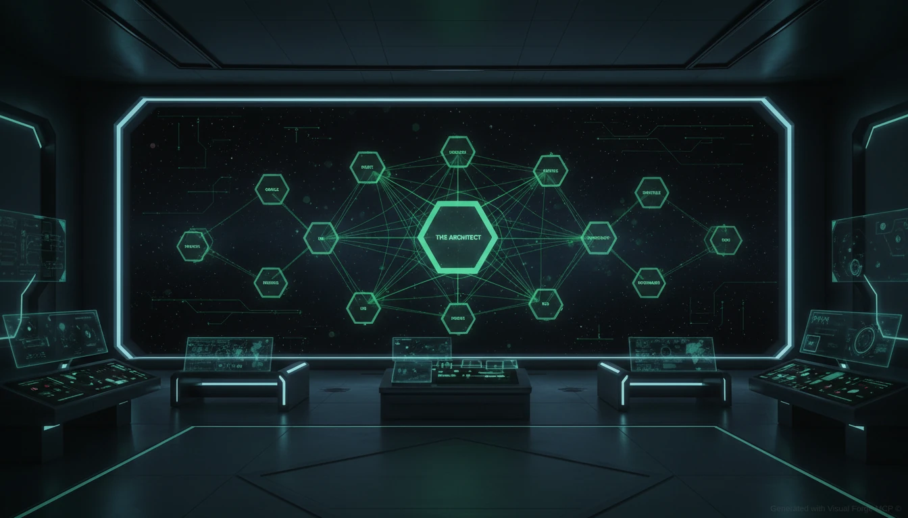

# The Construct

<p align="center">
  
</p>

<p align="center">
  <strong>AI Orchestration Architecture</strong><br>
  <em>"Code that calls AI, not AI that calls code"</em>
</p>

<p align="center">
  <a href="#features">Features</a> •
  <a href="#quick-start">Quick Start</a> •
  <a href="#architecture">Architecture</a> •
  <a href="#documentation">Docs</a> •
  <a href="#the-matrix-connection">Why Matrix?</a>
</p>

<p align="center">
  
  
  
  
</p>

---

> **⚠️ Work in Progress**
>
> This project is actively under development. While the core architecture is implemented with 927 passing tests, APIs may change and some features are still being refined. We welcome contributors who want to help shape the future of AI orchestration!
>
> **[Contributors Welcome!](#contributing)** Whether you're fixing bugs, improving documentation, or adding new features, we'd love your help.

---

> *"This is the Construct. It's our loading program. We can load anything, from clothing to equipment, weapons, training simulations... anything we need."*
>
> — Morpheus

---

<p align="center">
  
</p>

## What Is This?

**The Construct** is a reference architecture for AI orchestration that enforces deterministic control over AI systems. It solves the fundamental problem of modern AI development:

**AI ignores your rules.**

CLAUDE.md? Ignored. System prompts? "Forgot" them. Constraints? Creatively bypassed.

The Construct fixes this by making **code enforce rules**, not AI's willingness to follow them.

### The Core Principle

```
┌─────────────────────────────────────────────────────────────┐
│                                                             │
│   Traditional Approach:                                     │
│   "AI, please follow these rules" → AI ignores them         │
│                                                             │
│   The Construct Approach:                                   │
│   Code enforces rules → AI works within boundaries          │
│                                                             │
└─────────────────────────────────────────────────────────────┘
```

## Features

| Feature | Description |
|---------|-------------|
| **Contract-Based Execution** | Every AI task has a formal contract with constraints, limits, and quality criteria |
| **Provider Agnostic** | Works with OpenAI, Anthropic, Google, Ollama, Azure, and 100+ providers via LiteLLM |
| **Code-Enforced Rules** | Rules checked by code at every step, not by AI's willingness |
| **XP & Level System** | Agents earn XP for good work, unlock capabilities as they level up |
| **Zero Trust Security** | Agent Smith provides continuous verification and threat detection |
| **Chaos Engineering** | The Twins test resilience through controlled fault injection |
| **Migration Wizard** | Morpheus helps migrate existing projects to The Construct |
| **Comprehensive QA** | Sentinels validate all outputs and block unauthorized actions |

## Quick Start

### Installation

```bash
# Clone the repository
git clone https://github.com/your-org/the-construct-architecture.git
cd the-construct-architecture

# Install dependencies
npm install

# Build
npm run build

# Run tests (927 tests)
npm test
```

### Your First Contract

```yaml
# construct/contracts/hello-world.yaml
id: my-app/hello-world
name: Hello World Generator
version: "1.0.0"
type: completion

prompts:
  system: You are a friendly assistant.
  user: Say hello to {{name}} in a creative way.

limitations:
  forbidden_actions:
    - Use profanity
    - Be rude
  constraints:
    - Keep response under 100 words

limits:
  time:
    max_duration_ms: 10000
```

### Execute It

```typescript
import { createArchitect, createAgent, createKeymaker } from 'the-construct';

// Initialize
const architect = createArchitect({ configPath: './construct/architect.yaml' });
const keymaker = createKeymaker({ defaultProvider: 'openai' });
const agent = createAgent({ id: 'greeter', architect, keymaker });

// Execute with enforced contract
const result = await agent.execute({
  contractId: 'my-app/hello-world',
  input: { name: 'Neo' },
});

console.log(result.output);
// "Hello Neo! Welcome to the real world.
//  Your journey of awakening begins now..."
```

## Architecture

<p align="center">
  
</p>

### The Hierarchy

```
┌─────────────────────────────────────────────────────────────┐
│                      THE ARCHITECT                          │
│                    (Source of Truth)                        │
│         Configurations • Rules • Limits • Guidance          │
└────────────────────────────┬────────────────────────────────┘
                             │
          ┌──────────────────┼──────────────────┐
          │                  │                  │
          ▼                  │                  ▼
┌──────────────────┐         │         ┌──────────────────┐
│    THE ORACLE    │         │         │   AGENT SMITH    │
│  (Judgment & XP) │◀───────┤         │   (Security)     │
│                  │         │         │                  │
│  Feedback loop   │         │         │  Zero Trust      │
│  XP awards       │         │         │  Auth & threats  │
│  Level system    │         │         │                  │
└────────┬─────────┘         │         └────────┬─────────┘
         │                   │                  │
         │ judges            │ inherits         │ protects
         ▼                   ▼                  ▼
┌─────────────────────────────────────────────────────────────┐
│                       THE AGENTS                            │
│                     (Orchestrator)                          │
│              Enforces rules • Issues contracts              │
└────────────────────────────┬────────────────────────────────┘
                             │
          ┌──────────────────┴──────────────────┐
          │                                     │
          ▼                                     ▼
┌──────────────────┐                   ┌──────────────────┐
│   THE SENTINELS  │                   │    THE TWINS     │
│  (QA Enforcement)│                   │ (Chaos Testing)  │
│                  │                   │                  │
│  Validates all   │                   │  Ghost: Faults   │
│  Blocks bad      │                   │  Phantom: Pen    │
│  Scores quality  │                   │  testing         │
└────────┬─────────┘                   └──────────────────┘
         │
         ▼
┌─────────────────────────────────────────────────────────────┐
│                      THE PROGRAMS                           │
│                       (Workers)                             │
│           Execute tasks within contracts                    │
└────────────────────────────┬────────────────────────────────┘
                             │
                             ▼
┌─────────────────────────────────────────────────────────────┐
│                      THE KEYMAKER                           │
│                    (Tool Adapter)                           │
│     Provider-agnostic AI calls via LiteLLM                  │
└─────────────────────────────────────────────────────────────┘
```

### Component Summary

| Component | Matrix Character | Role |
|-----------|------------------|------|
| **Architect** | The Architect | Source of truth - configs, rules, limits |
| **Oracle** | The Oracle | Judgment, XP system, insights |
| **Agents** | Agent programs | Orchestration, contract execution |
| **Sentinels** | Sentinels | QA enforcement, validation |
| **Programs** | Programs | Workers that execute tasks |
| **Keymaker** | The Keymaker | Provider-agnostic AI adapter |
| **Smith** | Agent Smith | Zero Trust security |
| **Twins** | The Twins | Chaos engineering |
| **Morpheus** | Morpheus | Migration wizard |

## The Execution Flow

<p align="center">
  
</p>

```
Request → Architect (rules) → Smith (auth) → Agents (orchestrate)
    → Keymaker (AI call) → Sentinels (validate) → Oracle (judge) → Response
```

Every step is enforced by code. AI can't skip steps, ignore rules, or bypass validation.

## The Migration Wizard: Morpheus

> *"I'm trying to free your mind, Neo."*

Already have an AI project? Morpheus helps you migrate to The Construct.

### The Nebuchadnezzar Crew

| Agent | Role | Capability |
|-------|------|------------|
| **Tank** | The Operator | Scans projects, analyzes code |
| **Trinity** | The Expert | Deep analysis, pattern detection |
| **Mouse** | The Designer | Generates configs and contracts |
| **Apoc** | The Strategist | Creates migration plans |
| **Switch** | The Skeptic | Validates everything |

### Run the Wizard

```bash
# Analyze your project
npx morpheus analyze ./my-project

# Generate migration plan
npx morpheus plan ./my-project

# Execute migration
npx morpheus migrate ./my-project
```

## Documentation

| Document | Description |
|----------|-------------|
| **[GUIDE.md](GUIDE.md)** | Complete guide with tutorials |
| [docs/architecture.md](docs/architecture.md) | Full architecture details |
| [docs/morpheus.md](docs/morpheus.md) | Migration wizard documentation |
| [docs/contract-schema.md](docs/contract-schema.md) | Contract YAML schema |
| [docs/security-architecture.md](docs/security-architecture.md) | Security with Agent Smith |
| [docs/level-up-system.md](docs/level-up-system.md) | XP and leveling mechanics |

## The Matrix Connection

Why use Matrix characters? Because the metaphor is perfect:

| Matrix Concept | AI Development Problem | Our Solution |
|----------------|------------------------|--------------|
| The Matrix | AI systems that seem controllable but aren't | Explicit, code-enforced control |
| Taking the red pill | Realizing AI ignores your rules | Accepting the need for enforcement |
| The Construct | Safe loading environment | Controlled execution environment |
| Agents | Programs that enforce rules | Our orchestrators |
| The Architect | Designer of the system | Configuration as code |
| The Oracle | Sees patterns, guides | XP system, insights |

The Matrix is about control vs. freedom. The Construct gives you **control** over AI while still getting the **benefits** of AI creativity—within enforced boundaries.

## Implementation Status

### Core Architecture ✅

- [x] Phase 1: Foundation (Architect, Contracts, Sentinels)
- [x] Phase 2: Oracle & Level-Up System
- [x] Phase 3: Multi-Provider Keymaker
- [x] Phase 4: Reference System & Registry
- [x] Phase 5: Full Sentinels QA
- [x] Phase 6: Security (Agent Smith)
- [x] Phase 7: Chaos Engineering (The Twins)

### Morpheus Migration Wizard ✅

- [x] Phase 8a: Foundation & Workflow Engine
- [x] Phase 8b: Tank Agent (Scanner)
- [x] Phase 8c: Mouse Agent (Generator)
- [x] Phase 8d: Trinity Agent (Analyzer)
- [x] Phase 8e: Switch Agent (Validator)
- [x] Phase 8f: Apoc Agent (Planner)
- [x] Phase 8g: CLI & Reporter
- [x] Phase 8h: Knowledge Base
- [x] Phase 8i: Testing & Documentation

**Total: 927 tests passing**

## Technology Stack

| Component | Technology |
|-----------|------------|
| Language | TypeScript 5.0+ |
| Schema Validation | Zod |
| AI Gateway | LiteLLM |
| Database | better-sqlite3 |
| Config Format | YAML |
| Testing | Jest |

## Project Structure

```
the-construct-architecture/
├── src/
│   ├── architect/          # Source of Truth
│   ├── oracle/             # Judgment & XP
│   ├── agents/             # Orchestration
│   ├── sentinels/          # QA Enforcement
│   ├── programs/           # Workers
│   ├── keymaker/           # Provider Adapter
│   ├── smith/              # Security
│   ├── chaos/              # Chaos Engineering
│   │   ├── ghost/          # Fault Injection
│   │   ├── phantom/        # Penetration Testing
│   │   └── twins.ts        # Coordinator
│   ├── morpheus/           # Migration Wizard
│   │   ├── crew/           # Tank, Mouse, Trinity, Switch, Apoc
│   │   ├── workflow/       # Workflow Engine
│   │   ├── knowledge/      # Patterns & Best Practices
│   │   ├── reporter/       # Report Generation
│   │   └── cli/            # Command Line Interface
│   └── types/              # TypeScript Types
├── docs/
│   ├── images/             # Brand images
│   ├── architecture.md
│   ├── morpheus.md
│   └── ...
├── test/                   # 927 tests
├── GUIDE.md                # Complete guide
└── README.md               # This file
```

## Contributing

We welcome contributions! This is a community project and we'd love your help.

See [CONTRIBUTING.md](CONTRIBUTING.md) for detailed guidelines.

```bash
# Fork, clone, install
git clone https://github.com/your-username/the-construct-architecture.git
npm install

# Create feature branch
git checkout -b feature/my-feature

# Make changes, run tests
npm test

# Submit PR
```

**Ways to contribute:**
- Report bugs and issues
- Improve documentation
- Add new features
- Write tests
- Share feedback and ideas

## Author & Credits

**Author:** [Michel Abboud](https://github.com/michelabboud)

### AI Collaboration Transparency

This project was developed with significant assistance from **Claude** (Anthropic's AI assistant). In the spirit of transparency:

- **Architecture Design:** Collaborative effort between Michel Abboud and Claude
- **Code Implementation:** Written with Claude's assistance using Claude Code CLI
- **Documentation:** Co-authored with Claude
- **Tests:** Developed with Claude's help (927 tests)

We believe in being transparent about AI involvement in software development. This project demonstrates what's possible when humans and AI collaborate effectively—which is, ironically, exactly what The Construct architecture is designed to facilitate.

> *"The Construct was built using The Construct's principles—code controlling AI, with AI assisting the code."*

## Disclaimer

This project is not affiliated with, endorsed by, or connected to Warner Bros., The Matrix franchise, or any related entities. Character names and concepts from The Matrix are used as metaphorical inspiration only. All trademarks are the property of their respective owners.

## License

Apache License 2.0 - see [LICENSE](LICENSE) and [NOTICE](NOTICE) for details.

This license requires attribution. If you use this project, please credit Michel Abboud and include the NOTICE file.

---

<p align="center">
  <strong>Take the red pill.</strong><br>
  <em>Build something real.</em>
</p>

<p align="center">
  
</p>

---

*"Welcome to the real world."* — Morpheus
