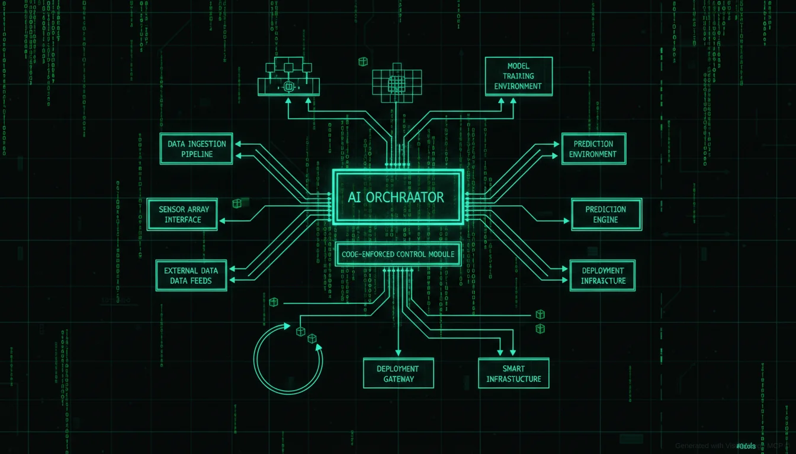
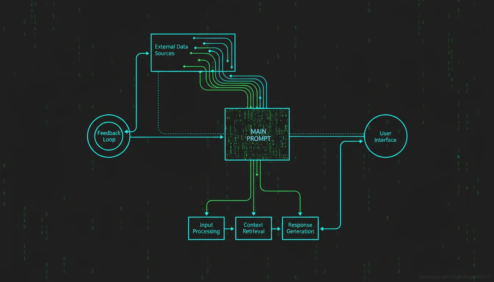

# The Construct - Architecture

> *"I am the Architect. I created the Matrix. I have been waiting for you."*

<p align="center">
  
</p>

## Overview

The Construct is a reference architecture for AI orchestration that enforces the principle **"Code that calls AI, not AI that calls code"**.

## The Problem

1. **AI alone can't be trusted to control workflows** - Gets distracted, ignores rules, "forgets"
2. **Pure rule-based systems don't need AI** - If everything is deterministic, why have AI?
3. **CLAUDE.md approach failed** - AI ignores it, doesn't work in non-Anthropic environments
4. **Need consistency AND creativity** - Strict where needed, flexible where valuable

## The Hierarchy

```
┌─────────────────────────────────────────────────────────┐
│                   THE ARCHITECT                         │
│              (Source of Truth)                          │
│                                                         │
│   "I am the Architect. I created the Matrix.            │
│    I have been waiting for you."                        │
│                                                         │
│   The single source of truth. Immutable during          │
│   execution. All rules, limits, guidance flow from      │
│   here. Cold, logical, absolute.                        │
└────────────────────────┬────────────────────────────────┘
                         │
          ┌──────────────┴──────────────┐
          │                             │
          ▼                             │
┌─────────────────────┐                 │
│    THE ORACLE       │                 │
│  (Judgment &        │◀────────────────┤
│   Insight)          │   exposes       │
│                     │   learnings     │
│  Collects all       │                 │
│  agent feedback,    │                 │
│  sees patterns,     │                 │
│  guides evolution   │                 │
└─────────┬───────────┘                 │
          │                             │
          │ informed by                 │ inherits truth
          │ judgments                   │
          │                             │
          ▼                             ▼
┌─────────────────────────────────────────────────────────┐
│                   THE AGENTS                            │
│                 (Orchestrator)                          │
│                                                         │
│   "Never send a human to do a machine's job."           │
│                                                         │
│   Enforces the Architect's design. Does not make        │
│   rules, only executes them. Cannot modify truth.       │
└────────────────────────┬────────────────────────────────┘
                         │
          ┌──────────────┴──────────────┐
          │                             │
          ▼                             │
┌─────────────────────┐                 │
│   THE SENTINELS     │◀────────────────┤
│  (QA & Enforcement) │   polices       │
│                     │   agents        │
│  Validates outputs, │                 │
│  blocks unauthorized│                 │
│  actions, scores    │                 │
│  quality            │                 │
└─────────┬───────────┘                 │
          │                             │
          ▼                             ▼
┌─────────────────────────────────────────────────────────┐
│                   THE PROGRAMS                          │
│                  (Workers)                              │
│                                                         │
│   "Every program that is created must have a            │
│    purpose. If it does not, it is deleted."             │
│                                                         │
│   Executes tasks within contracts. Reports outcomes     │
│   to the Oracle. Earns XP, levels up through good work. │
└────────────────────────┬────────────────────────────────┘
                         │
                         ▼
┌─────────────────────────────────────────────────────────┐
│                   THE KEYMAKER                          │
│                 (Tool Adapter)                          │
│                                                         │
│   "I know because I must know. It is my purpose."       │
│                                                         │
│   Provider-agnostic tool calling. Adapts any AI         │
│   provider to work with contracts. Uses LiteLLM.        │
└─────────────────────────────────────────────────────────┘
```

## Component Details

### The Architect (Source of Truth)

The **single, immutable source of truth** for the entire system. Everything the Orchestrator needs to know flows from here.

**Properties:**
- **Authoritative** - The final word on what is allowed
- **Immutable** - Cannot be changed during execution
- **Comprehensive** - Contains all configurations, rules, limits, guidance
- **Versioned** - Changes are tracked, auditable
- **Hierarchical** - Global truth + project-specific extensions

**Contains:**
```typescript
interface Architect {
  configurations: {
    providers: ProviderConfig[];
    storage: StorageConfig;
    defaults: DefaultConfig;
  };
  settings: {
    mode: 'development' | 'production';
    verbosity: 'silent' | 'normal' | 'verbose' | 'debug';
    preferences: Preferences;
    featureFlags: Record<string, boolean>;
  };
  guidance: {
    systemPrompts: Record<string, string>;
    contractTemplates: Record<string, ContractTemplate>;
    fewShotExamples: Record<string, Example[]>;
    styleGuide: StyleGuide;
  };
  limits: {
    costs: CostLimits;
    usage: UsageLimits;
    storage: StorageLimits;
  };
  rules: {
    paths: PathRules;
    actions: ActionRules;
    content: ContentRules;
    models: ModelRules;
  };
  schemas: {
    contracts: JSONSchema;
    outputs: Record<string, JSONSchema>;
  };
  registry: {
    services: Record<string, ServiceConfig>;
    tools: Record<string, ToolConfig>;
    workflows: Record<string, WorkflowConfig>;
  };
  references: {
    documentation: Record<string, string>;
    examples: Record<string, string>;
  };
}
```

**API:**
```typescript
interface ArchitectAPI {
  // All READ-ONLY operations
  getConfig<T>(path: string): T;
  getSetting<T>(path: string): T;
  getLimit(path: string): number;
  isActionAllowed(action: string): boolean;
  isPathAllowed(path: string, operation: 'read' | 'write'): boolean;
  getSystemPrompt(role: string): string;
  getContractTemplate(taskType: string): ContractTemplate;
  validateContract(contract: Contract): ValidationResult;

  // NO WRITE OPERATIONS - Truth is immutable at runtime
}
```

### The Oracle (Judgment & Insight)

The **feedback collector, pattern recognizer, and guide**. Every agent outcome flows through the Oracle.

**Responsibilities:**
- **Collects** - All agent results, scores, outcomes
- **Analyzes** - Patterns, trends, anomalies
- **Judges** - Renders verdicts on agent performance
- **Exposes** - Insights to Architect for future guidance
- **Manages** - The Level-Up system (XP, achievements)

**Feedback Loop:**
1. Agent completes task
2. Program reports to Oracle (task ID, output, duration, cost)
3. Oracle evaluates (validates, scores, checks compliance)
4. Oracle renders judgment (APPROVED / NEEDS_REVISION / ESCALATE)
5. Oracle updates records (XP, level, history)
6. Oracle exposes insights to Architect

### The Agents (Orchestrator)

The **enforcer of the Architect's design**. Does not make rules, only executes them.

**Responsibilities:**
- Parse contracts
- Validate against Architect rules
- Coordinate Programs
- Track state machine
- Report to Oracle

### The Sentinels (QA & Enforcement)

**Important:** The Sentinels are NOT just observability/monitoring. They are QA/enforcement - they police agents and ensure they do their work properly.

**Responsibilities:**
- Validate outputs against contract requirements
- Block forbidden actions (path checks, action checks)
- Score quality
- Escalate to human review when needed

### The Programs (Workers)

The **task executors**. Each has a purpose and works within its contract.

**Responsibilities:**
- Execute AI calls with contract context
- Handle tool responses
- Report outcomes to Oracle
- Earn XP through good work

### The Keymaker (Tool Adapter)

The **provider-agnostic interface**. Adapts any AI provider to work with contracts.

**Responsibilities:**
- Unified API via LiteLLM
- Tool call translation
- Provider fallback
- Performance-based routing

## Data Flow

<p align="center">
  
</p>

```
User Request
     │
     ▼
┌─────────────┐
│  Architect  │──────────────────────────────────────┐
│  (Truth)    │                                      │
└─────────────┘                                      │
     │                                               │
     │ loads rules                                   │
     ▼                                               │
┌─────────────┐                                      │
│   Agents    │◀──────────────────────────────────┐  │
│(Orchestrate)│                                   │  │
└─────────────┘                                   │  │
     │                                            │  │
     │ issues contract                            │  │
     ▼                                            │  │
┌─────────────┐     validates      ┌─────────────┐   │
│  Programs   │────────────────────│  Sentinels  │   │
│  (Workers)  │                    │ (QA/Enforce)│   │
└─────────────┘                    └─────────────┘   │
     │                                   │           │
     │ executes via                      │ reports   │
     ▼                                   │ quality   │
┌─────────────┐                          │           │
│  Keymaker   │                          │           │
│  (LiteLLM)  │                          │           │
└─────────────┘                          │           │
     │                                   │           │
     │ returns result                    │           │
     ▼                                   ▼           │
┌─────────────┐                    ┌─────────────┐   │
│   Output    │───────────────────▶│   Oracle    │──┘
│             │   submits for      │ (Judgment)  │
└─────────────┘   judgment         └─────────────┘
```

## Truth Inheritance

```
~/.construct/truth/             # GLOBAL TRUTH
├── global.yaml                 # Base truth
├── providers.yaml              # Provider configs
├── limits.yaml                 # Cost/usage limits
├── rules.yaml                  # Path/action rules
├── guidance/                   # Prompts, templates
└── schemas/                    # Validation schemas

~/my-project/.construct/        # PROJECT TRUTH (extends global)
└── truth.yaml                  # Project-specific overrides

# Effective truth = Global + Project overrides
# Project can: extend, override, restrict (never loosen security)
```

## Key Principles

1. **Code enforces, not AI** - Rules are checked by code at every step
2. **Immutable truth** - Architect cannot be modified during execution
3. **Positive-only incentives** - XP for good work, no penalties for bad
4. **Contracts are formal** - Every task has explicit requirements and limits
5. **Provider-agnostic** - Any AI provider works through Keymaker
6. **Observable** - Every action is logged and traceable
